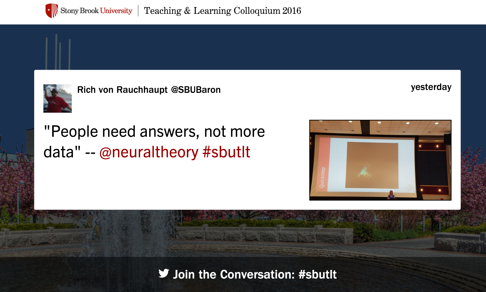

# socialwall

The social wall project is meant to display tweets live during an event. Its branded with University logo's and imagery based off the Unity theme.

Based off of php and javascript.

Inspired and based off of the work done by Kevin Liew and the codebird team found on: http://www.queness.com/post/8567/create-a-dead-simple-twitter-feed-with-jquery
